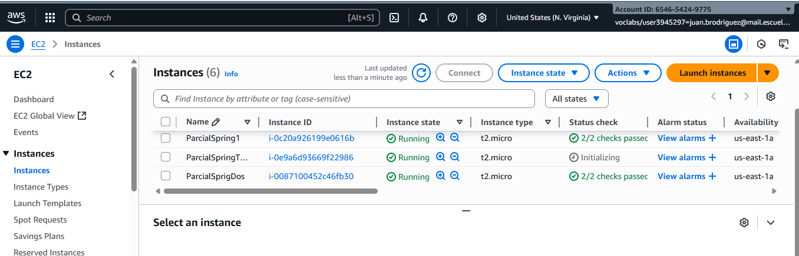
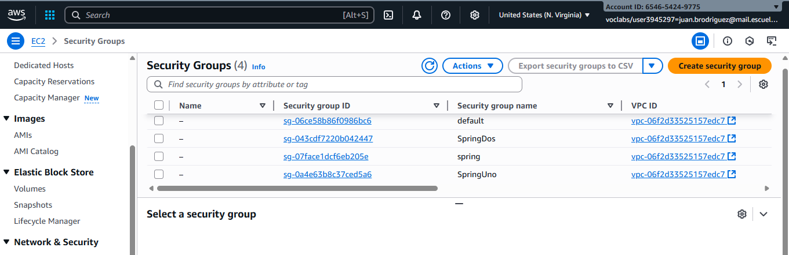

# Algoritmos 
## Video 

## Imagenes




## Arquitectura del Sistema
- **Instancia 1 (Puerto 8080)**: Para un  número dado n 
- **Instancia 2 (Puerto 8081)**: Para los primos
- **Instancia 3 (Puerto 8082)**: Proxy que distribuye peticiones

## IPs de las Instancias
- **Instancia 1 (Lineal)**: `54.166.212.135:8080`
- **Instancia 2 (Binaria)**: `34.234.92.170:8081`
- **Instancia 3 (Proxy)**: `52.23.158.164:8082`

## Ejecutar Localmente
```bash
./mvnw spring-boot:run
```

## Deployment en AWS EC2

### Paso 1: Crear 3 Instancias EC2
- **Tipo**: t2.micro 
- **Security Groups**: 
  - Instancia 1: Puerto 8080
  - Instancia 2: Puerto 8081  
  - Instancia 3: Puerto 8082
  - SSH Puerto 22 en todas

### Paso 2: Configurar Cada Instancia

#### Instancia 1 (Puerto 8080):
```bash
# Conectar
ssh -i ec2-user@54.166.212.135

# Instalar dependencias
sudo yum update -y
sudo yum install -y java-17-amazon-corretto-devel git


# Configurar puerto
echo "server.port=8080" > src/main/resources/application.properties

# Ejecutar
./mvnw spring-boot:run
```

#### Instancia 2 (Puerto 8081):
```bash
# Conectar
ssh -i ec2-user@34.234.92.170

# Instalar dependencias
sudo yum update -y
sudo yum install -y java-17-amazon-corretto-devel git


# Configurar puerto
echo "server.port=8081" > src/main/resources/application.properties

# Ejecutar
./mvnw spring-boot:run
```

#### Instancia 3 (Proxy - Puerto 8082):
```bash
# Conectar
ssh -i ec2-user@52.23.158.164

# Instalar dependencias
sudo yum update -y
sudo yum install -y java-17-amazon-corretto-devel git

# Configurar puerto
echo "server.port=8082" > src/main/resources/application.properties

# Ejecutar
./mvnw spring-boot:run
```

### Paso 3: Probar el Sistema

#### Acceder al Proxy (Punto de entrada único):
```
http://52.23.158.164:8082
```

## Flujo de Funcionamiento
1. Usuario accede a `http://52.23.158.164:8082`
2. Llena formulario 
3. Proxy recibe petición y parámetro "tipo"
4. Si tipo=primo → Envía a instancia 1 (puerto 8080)
5. Si tipo=factores → Envía a instancia 2 (puerto 8081)
6. Instancia especializada procesa búsqueda
7. Proxy retorna resultado con " - Proxy" al final

## Verificación
- Las 3 instancias deben estar corriendo simultáneamente
- Cada respuesta incluye identificación del servidor
- El proxy distribuye correctamente según el tipo solicitado
